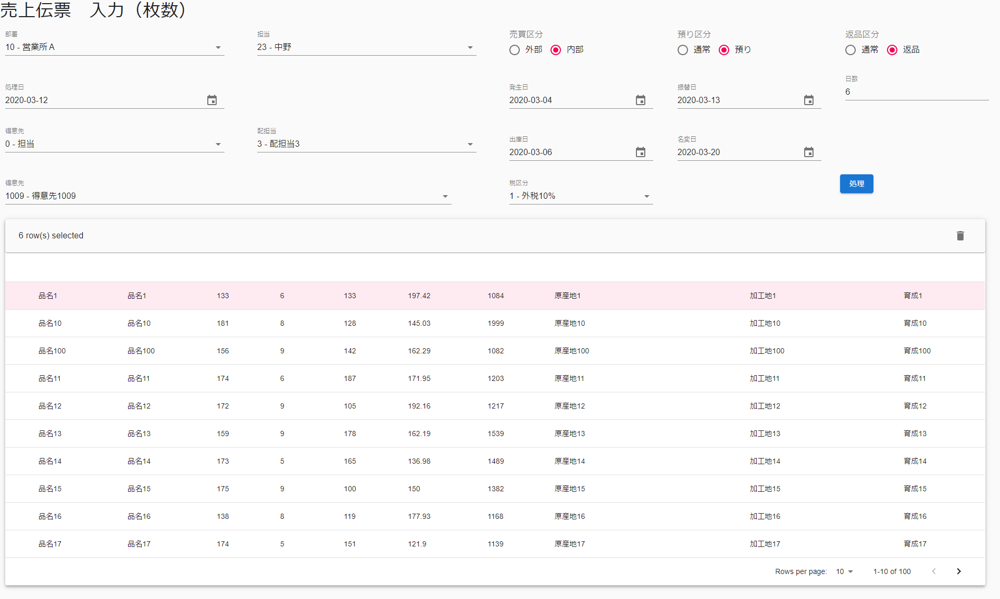
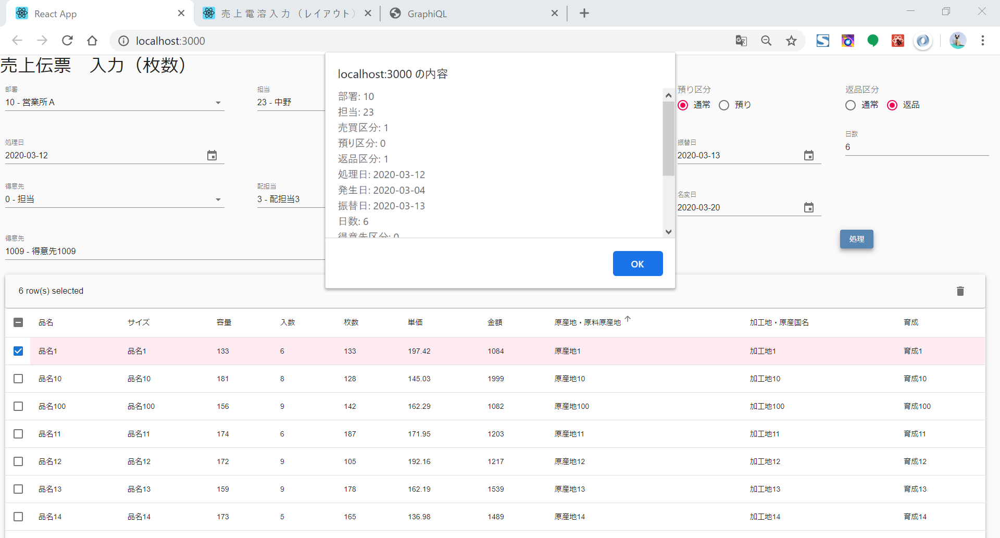

# daikyo-sample-09
大京のサンプル09（Apollo Clientを用いての売上伝票入力画面）

## バックエンドのデプロイ

バックエンドを[zeit now](https://zeit.co/)にデプロイしました。

https://now-apollo-deploy.aki323buri2.now.sh/graphql

[リポジトリ](https://github.com/a-nakajima-at-shokuryu/now-apollo-deploy)


## インストール
```
> npx create-react-app daikyo-sample
> yarn add @material-ui/core
> yarn add @material-ui/pickers
> yarn add @material-ui/icons
> yarn add @date-io/date-fns@1.x     ←バージョン1を入れないとMaterialUIのDateTimePickerが動かない？
> yarn add date-fns
> yarn add mui-datatables
> yarn add graphql
> yarn add graphql-tag
> yarn add express
> yarn add express-graphql
> yarn add react-apollo
> yarn add react-apollo-hooks
> yarn add apollo-client
> yarn add apollo-link-http
> yarn add apollo-cache-inmemory
```

## サーバサイド
事前に
```
> node src/data.js
```
で、GraphQLを起動しておいてください。


## 実行
このサンプルはstorybookではなく
```
> yarn start
```
で実行してください


## 画面キャプチャ

▼画像キャプチャ


▼処理ボタン押下


